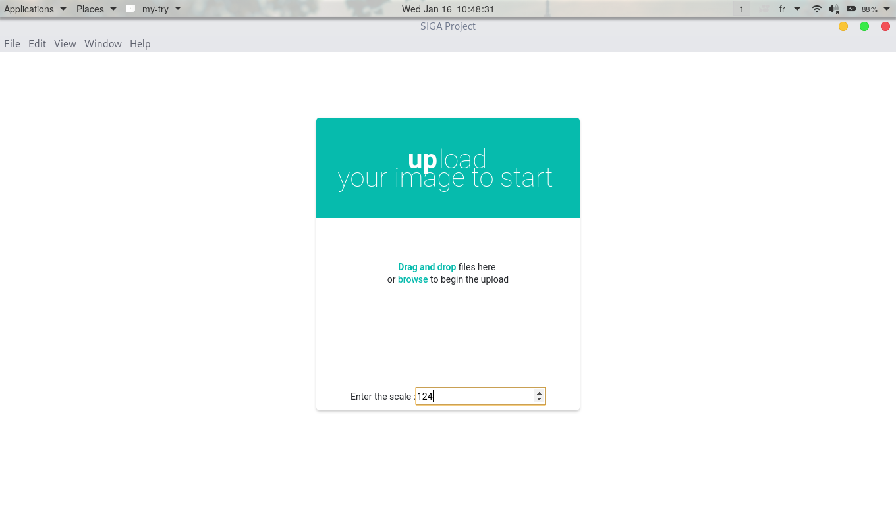
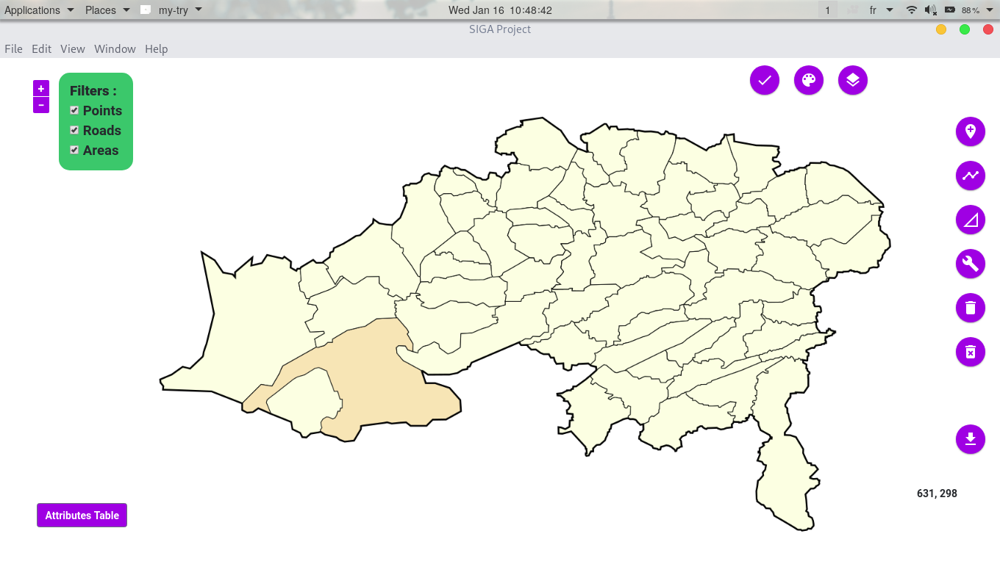
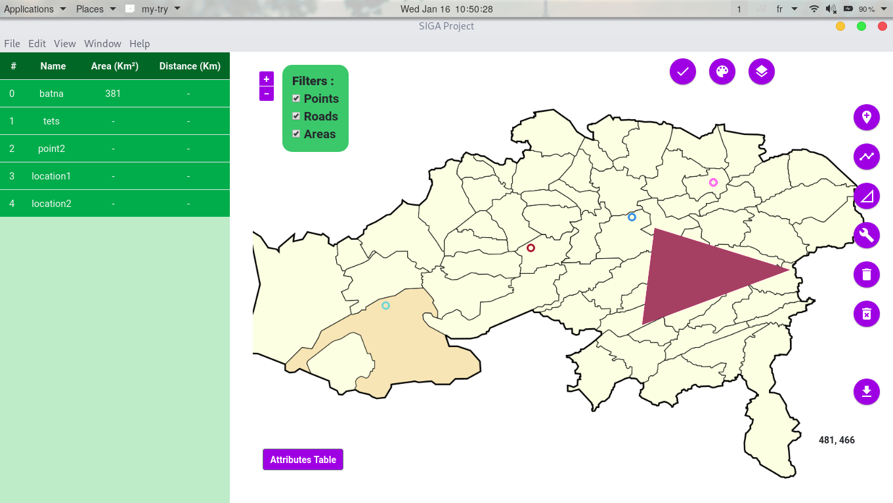

# SIGA - ESI project 2018/2019

# Projet SIGA (Système d'Information Géographique Avancé):

Implémentation de quelques modules « Outils SIG » : Création
 d’une application «Outils SIG» sans géo référencement,
  uniquement avec des positions cartésiennes X et Y.


# Features
-----

* Import your map
* Enter the scale (1 pixel  ===  ? meters)
* Draw shapes: polygons, points, lines
* Delete any shape
* Delete all shapes
* Symbology (color the shapes)
* Zoom
* Operation (intersection)
* Attribute table : automatic fill (for areas and distances)
* Export the map with the drawings

# Demo
-----






# Usage
-----

```
 $ git clone https://github.com/medbenchohra/ESI_2CS_SIGA_Project
 $ cd ESI_2CS_SIGA_Project
 $ npm i
 $ npm start

```
# Authors
-----
* Mohamed Amine Benchohra 
https://github.com/medbenchohra

* Mahamdi Mohammed 
https://github.com/MahamdiAmine

* Adrao nassim 
https://github.com/nassimesi 

* Rahmoune Imene 
https://github.com/mimene 

# Licence
-----
MIT licence:
https://www.gnu.org/licenses/gpl-3.0